<div align="center"><h1>Rofi</h1>
<p align="center">A collection of <a href="https://github.com/davatorium/rofi">Rofi</a> based custom <i>Applets</i>, <i>Launchers</i> & <i>Powermenus</i>.</p>

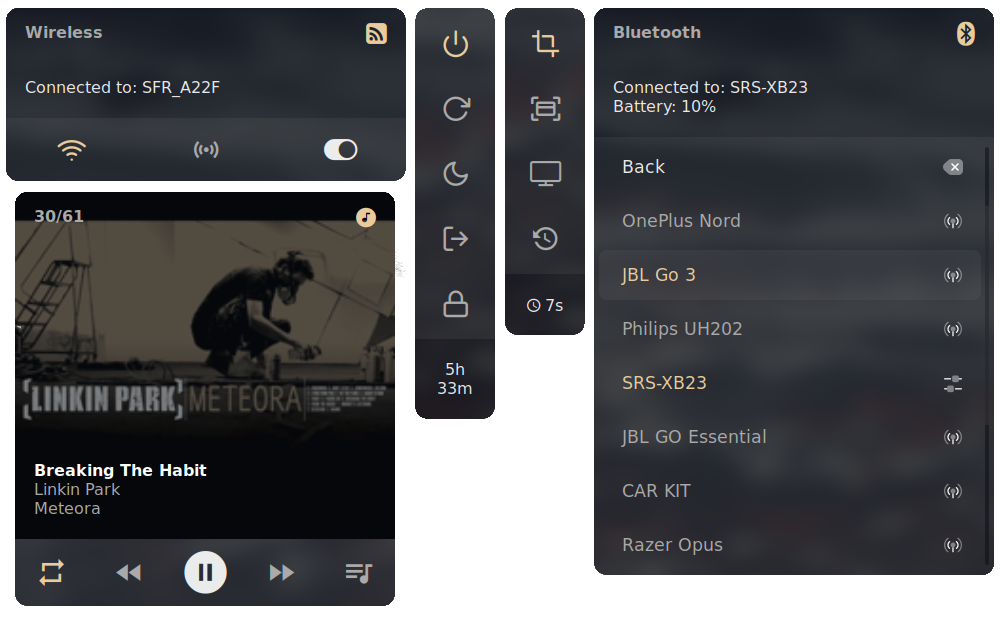

## What is Rofi?

[Rofi](https://github.com/DaveDavenport/rofi) is A window switcher, Application launcher and dmenu replacement. Rofi started as a clone of simpleswitcher and It has been extended with extra features, like an application launcher and ssh-launcher, and can act as a drop-in dmenu replacement, making it a very versatile tool. Rofi, like dmenu, will provide the user with a textual list of options where one or more can be selected. This can either be running an application, selecting a window, or options provided by an external script.
</div>

## Installation

> **Everything here is created on rofi version : `1.7.5`**
* First, Make sure you have the same (stable) version of rofi installed.
  - On Arch / Arch-based : **`sudo pacman -S rofi`**
  - On Debian / Ubuntu : **`sudo apt-get install rofi`**
  - On Fedora : **`sudo dnf install rofi`**

- Then, Clone this repository and follow indications in the [notes](#Notes) section
```
$ git clone https://github.com/mdfk15/Rofi.git
```

### Previews Widgets


<details>
<summary><b>Wifi</b></summary>

|Main & Confirm|List|
|:--:|--|
|<table><tr><th>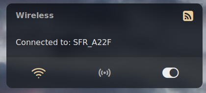</th></tr><tr><td>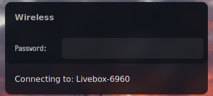</td></tr></table>|<table><tr><th>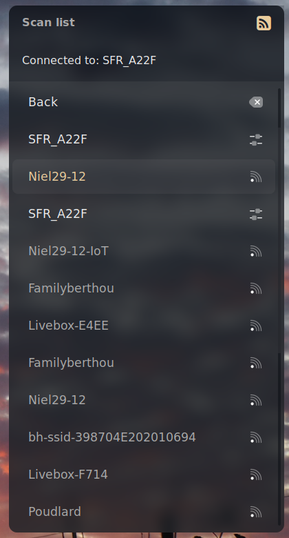</th></tr></table>|

</details>

<details>
<summary><b>Bluetooth</b></summary>

|Main menu|List menu|
|--|--|
|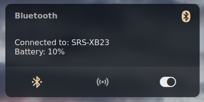|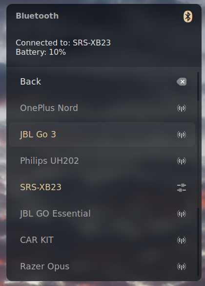

</details>

<details>
<summary><b>Musictl</b></summary>

|Main menu|List menu|
|--|--|
|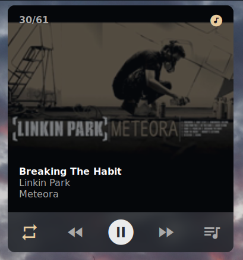|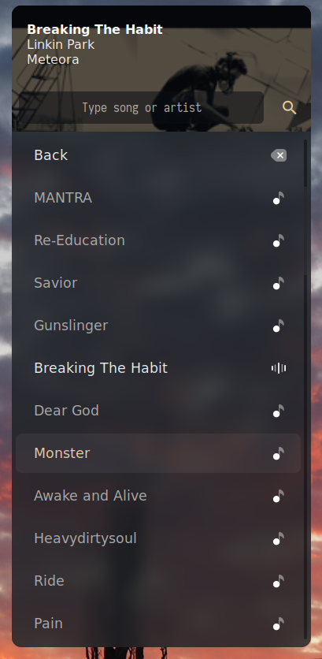

</details>

<details>
<summary><b>Battery, Volume</b></summary>

|Battery|Volume|
|--|--|
|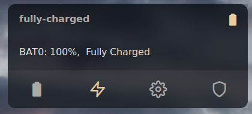|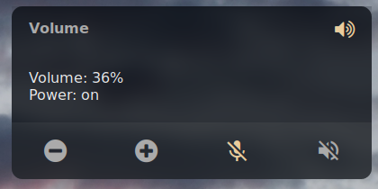|


</details>


<details>
<summary><b>Calendar</b></summary>

|Calendar|
|--|
|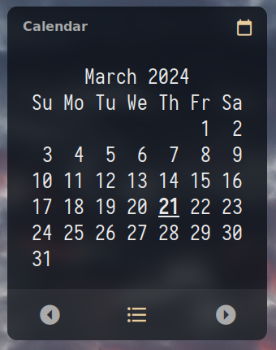|

</details>

<details>
<summary><b>Screenshot and Powermenu</b></summary>

|Screenshot|Powermenu|
|--|--|
|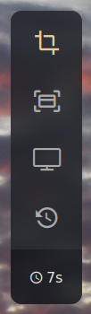|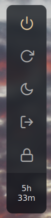|

</details>

<summary><b>Launcher</b></summary>

Then, execute launcher: ```$ rofi -show drun -theme /path/to/rasi/launcher.rasi```
|Launcher|
|--|
|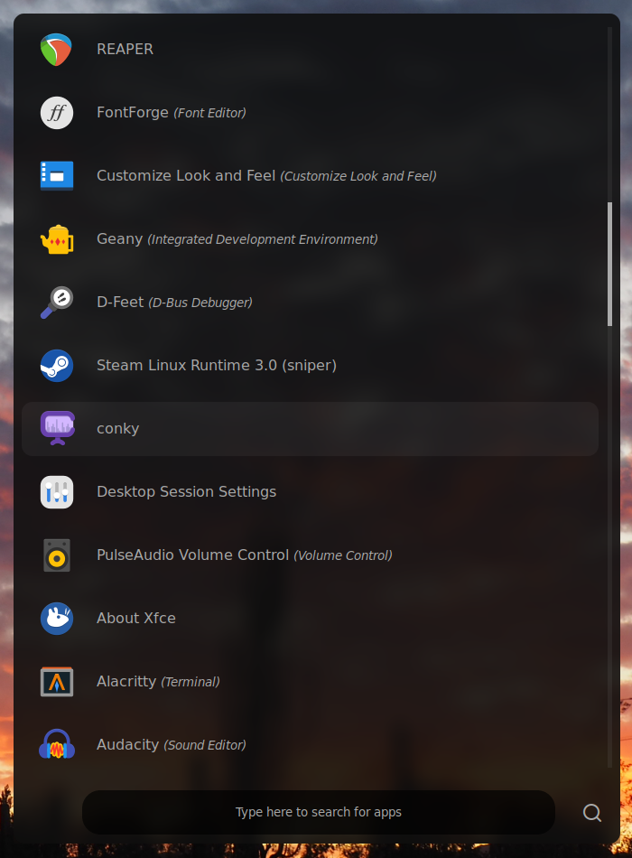

## Notes
- There's no install script, because I'd suggest using these files as templates rather than directly copying them (simply because they weren't designed to be cross-platform). If you would like to use these files, you can try doing the following manually:
    - install `/rasi/` to `~/.config/rofi`
    - install `/scripts/` to `~/.config/scripts/`
    - install `/icons/` to `~/.icons/`
- Also you can check my [dotfiles](https://github.com/mdfk15/dotfiles)
