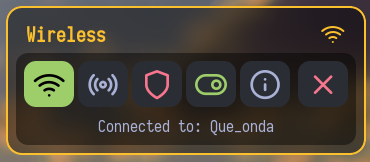
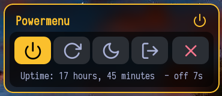
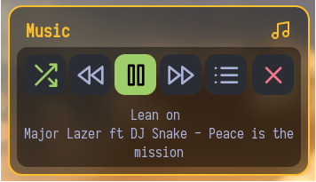
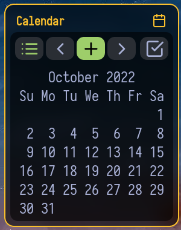
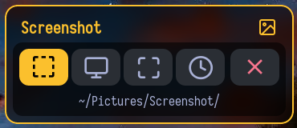
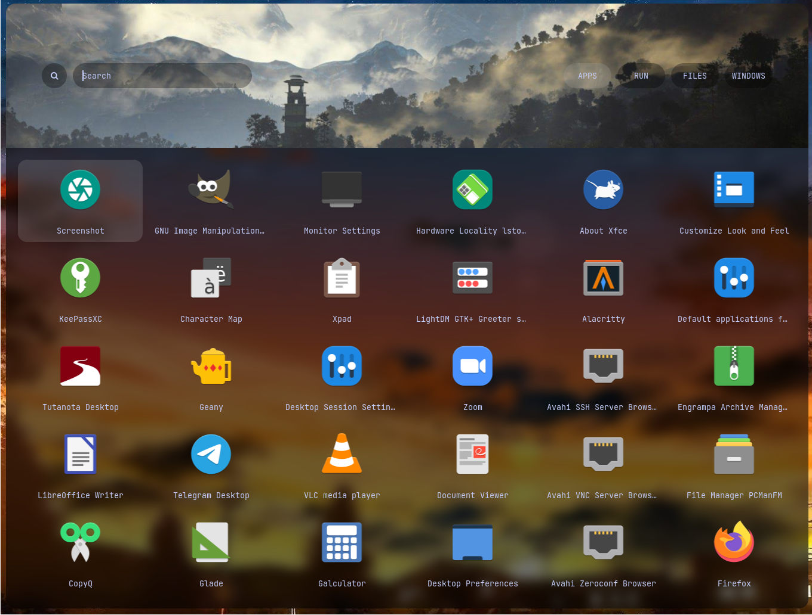

# Rofi
<p align="center">A collection of <a href="https://github.com/davatorium/rofi">Rofi</a> based custom <i>Applets</i>, <i>Launchers</i> & <i>Powermenus</i>.</p>

## What is Rofi?

[Rofi](https://github.com/DaveDavenport/rofi) is A window switcher, Application launcher and dmenu replacement. Rofi started as a clone of simpleswitcher and It has been extended with extra features, like an application launcher and ssh-launcher, and can act as a drop-in dmenu replacement, making it a very versatile tool. Rofi, like dmenu, will provide the user with a textual list of options where one or more can be selected. This can either be running an application, selecting a window, or options provided by an external script.

## Installation

> **Everything here is created on rofi version : `1.7.5`**
* First, Make sure you have the same (stable) version of rofi installed.
  - On Arch / Arch-based : **`sudo pacman -S rofi`**
  - On Debian / Ubuntu : **`sudo apt-get install rofi`**
  - On Fedora : **`sudo dnf install rofi`**

- Then, Clone this repository -
```
$ git clone https://github.com/mdfk15/Rofi.git
```

### Previews

<summary><b>Widgets</b></summary>

|Wireless|Bluetooth|Powermenu|
|--|--|--|
|||

|Misc|calendar|Screenshot|
|--|--|--|
|||

Then, execute launcher: ```$ rofi -show drun -theme /path/to/rasi/launcher.rasi```
|Launcher|
|--|
|
